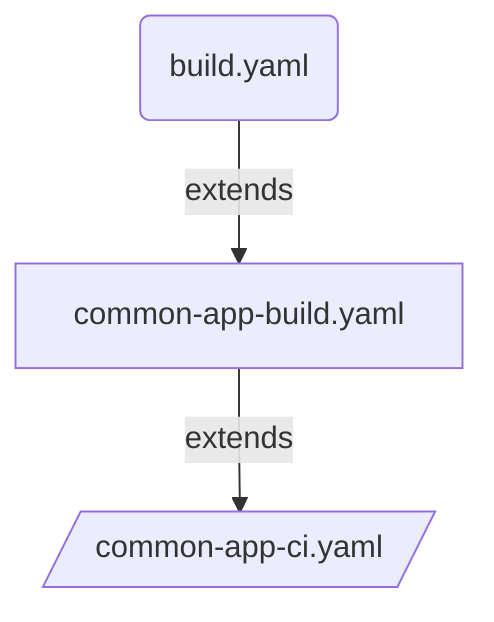

# Route to live deployment using CI & CD pipeline template

## Introduction

Extend the `common-app-ci.yaml` pipeline-template to create your route-to-live build and deployment strategy. This allows to set the list of environments that compose the route-to-live progression. 




## Overview of pipeline

```yaml
stage: Application_CI
  jobs: 
    job: Initialise
      steps: 
        task: GetAppVersion
    job: Build
    dependsOn: Initialise
      steps: 
        task: Sonar Analysis prepare
        # if .Net App
            task: UseDotNet Version
            task: DotNetCoreCLI Restore
            task: DotNetCoreCLI Build
            task: DotNetCoreCLI test
        # if Node JS App
            task: NodeTool Version
            task: Npm ci
            task: Npm audit     # Fail pipeline for threashold breach, if PR build
            task: Npm lint      # if-present, Fail pipeline for threashold breach, if PR build
            task: Npm build     # if-present
            task: Npm unit test # if-present
        task: Sonar Analysis Publish
        task: Snyk application security scan # Fail pipeline for threashold breach, if PR build
        task: Helm Lint
    job: BuildImage
    dependsOn: Initialise
        task: Docker Build Image
        task: Helm Build Chart
        task: Snyk container security scan # Fail pipeline for threashold breach, if PR build
    job: Publish Artifacts
    dependsOn: Initialise,Build,BuildImage
        task: Publish Artifact - code version
        task: Publish Artifact - docker image
        task: Publish Artifact - helm chart
#For Each environment
#If master or main Branch build - Deploy to all environments
#If PR or Feature Branch build - Deploy to dev environment only
stage: Application_CD
dependsOn: Application_CI
  jobs: 
    deployment: PublishTo<Env>
      steps:
        task: Download artificats (code version, docker image, helm chart)
        task: Push secrets from variable group to application keyvault
        task: Validate Azure App Configuration json file
        task: Replace Tokens in Configuration json file
        task: Push Azure App Configuration to AzureAppConfig
        task: Push Docker Image to ACR
        task: Push Helm Chart to ACR

```

## Usage

Following pipeline `common-app-build.yaml` code snippet is an example of how to call `common-app-ci.yaml` template to implement CI and CD steps by abstacting the infrastructure details from dev team. So Dev team can focus on real development.

```yaml
# Example of abstracting the CI pipeline from dev team

parameters:
  - name: serviceName
    displayName: Project name
    type: string
  - name: deployFromFeature
    type: boolean
    default: false 
  - name: deployConfigOnly
    displayName: Deploy App Config Only
    type: boolean
    default: false       
  - name: appBuildConfig
    displayName: Details to build the app
    type: object
  - name: appTestConfig
    displayName: Details to test the app
    type: object
    default: null
  - name: appDeployConfig
    displayName: Details to deploy the app
    type: object
    default: null

resources:
  repositories:
    - repository: PipelineCommon
      name: DEFRA/ADO-Pipeline-Common
      endpoint: DEFRA
      type: github
      ref: main

extends:
  template: /templates/pipelines/common-app-ci.yaml@PipelineCommon
  parameters:
    serviceName: ${{ parameters.serviceName }}              #Mandatory: Project Name
    deployFromFeature: ${{ parameters.deployFromFeature }}  #Mandatory: True/False(default)  parameter used to deploy feature branch to dev environment.
    deployConfigOnly: ${{ parameters.deployConfigOnly }}    #Mandatory: True/False(default)  parameter used to deploy app config to various environments.
    privateAgentName: 'DEFRA-ubuntu2204'                    #Optional:  Name of the private build agent. default will use Azure hosted linux agent.
    packageFeedName: 'artifact-feed'                        #Mandatory: Name of the Azure Devops Artifacts package feed. Used by .Net and NodeJs build.
    appBuildConfig: ${{ parameters.appBuildConfig }}        #Mandatory: Object which contains configration used for building the application. Such as appFrameworkType, defaultBranch, frameworkVersion, projectPath, manifestPath, imageRepoName
    appTestConfig: ${{ parameters.appTestConfig }}          #Mandatory: Object which contains configration used for testing the application. Such as testFilePath, acceptanceTestFilePath etc
    appDeployConfig: ${{ parameters.appDeployConfig }}      #Mandatory: Object which contains configration used for application deployment. Such as config file path.
    snykConfig:                                             #Optional: 
      snykConnection: 'Connection name'                     #Mandatory: Name of the connection in ADO
      snykOrganizationName: 'defra'                         #Mandatory: Name of snyk organization
      failOnThreshold: 'critical'                           #Mandatory: Threshold to fail the task if vulrarabilies identified
    sonarConfig:                                            #Optional: 
      sonarConnection: 'SonarCloud Connection name'         #Mandatory: Name of the connection in ADO
      organization: defra                                   #Mandatory: Name of organization
      projectKeyPrefix: 'adp-'                              #Optional:  Prefix to be added while creating project key in Sonar
    npmConfig:                                              #Mandatory: 
      failOnThreshold: 'moderate'                           #Mandatory: Threshold to fail the task if issues identified
    environments:                                           #Mandatory: List of environments to deploy the application
      - name : sandbox                                      #Mandatory: name of the environment
        type : dev                                          #Mandatory: Type of the environment could be [dev,test,staging,prod]. feature branches will be deployed to dev env 
        serviceConnection: 'ARM Connection'                 #Mandatory: Name of the connection to be used for deployment
        acrName: 'acr name'                                 #Mandatory: Name of the ACR to push the docker and helm charts
        privateAgentName: 'sandbox-ubuntu2204'              #Optional:  Name of the private build agent, default will use Azure hosted linux agent.
        appConfiguration: 'application configration name'   #Optional:  Name of the Azure application configuration instance to push the config and secrets
        dependsOn: [ Application_CI ]                       #Mandatory: Names of one ore more stages. Application_CI stage is mandatory for all deployments


```

## Dev Team to extend the above pipeline template as follows

### build.yaml for .Net App

```yaml
parameters:
  - name: deployFromFeature
    displayName: "Deploy from Feature Branch"
    type: boolean
    default: false
  - name: deployConfigOnly
    displayName: Deploy App Config Only
    type: boolean
    default: false  
pr:
  branches:
    include:
      - master
  paths:
    exclude:
      - test-output/*
      - bin/*
      - obj/*
  drafts: false

trigger:
  batch: true
  branches:
    include:
      - "*"
  paths:
    exclude:
      - test-output/*
      - bin/*
      - obj/*

resources:
  repositories:
    - repository: DEFRA-ADPPipelineCommon
      name: DEFRA/adp-pipeline-common
      endpoint: DEFRA
      type: github
      ref: main
extends:
    template: /pipelines/common-app-build.yaml@DEFRA-ADPPipelineCommon
    parameters:
        serviceName: "serviceName"          #Mandatory
        deployFromFeature: true            #Mandatory: Default false. If set to True will deploy the feature branch code to Dev environment.
        deployConfigOnly: ${{ parameters.deployConfigOnly }} #Mandatory: True/False(default)  parameter used to deploy app config to various environments.
        appBuildConfig:
            appFrameworkType: "dotnet"      # Mandatory "dotnet" or "nodejs" used to run the appropriate build step            
            frameworkVersion: "6.x"         #Optional: Used by DotNet build task. Defaults to 6.x
            projectPath: "./ProjectName/ProjectName.csproj" #Mandatory: Used to extract project version. For DotNet projects provide the csproj file path. For NodeJS package.json file path.
            testProjectPath: "./ProjectName.Tests/ProjectName.Tests.csproj" #Optional: Used to run Unit Tests of DotNet Projects
            manifestPath: "./obj/ProjectName/project.assets.json" #Mandatory: Used by Snyk to identify the vulnerabilities.  packages.config (.NET Framework) .proj file or project.json or project.assets.json for (.NET Core) package.json for (NodeJS)
            imageRepoName: "repo-name"      #Mandatory: Used for publishing docker, helm charts and also used by snyk to publish the results
        appTestConfig:                      #Optional: Used for testing application
            testFilePath: './docker-compose.test.yaml'
        appDeployConfig:                    #Optional: Used for deploying application configuration to various environments
            filepath: "./appConfig"            #Optional: Folder path of app configuration files

```

### build.yaml for NodeJS App

```yaml
parameters:
  - name: deployFromFeature
    displayName: "Deploy from Feature Branch"
    type: boolean
    default: false
  - name: deployConfigOnly
    displayName: Deploy App Config Only
    type: boolean
    default: false  
pr:
  branches:
    include:
      - main
  paths:
    exclude:
      - test-output/*
      - bin/*
      - obj/*
  drafts: false

trigger:
  batch: true
  branches:
    include:
      - "*"
  paths:
    exclude:
      - test-output/*
      - bin/*
      - obj/*
resources:
  repositories:
    - repository: DEFRA-ADPPipelineCommon
      name: DEFRA/adp-pipeline-common
      endpoint: DEFRA
      type: github
      ref: main
extends:
    template: /pipelines/common-app-build.yaml@DEFRA-ADPPipelineCommon
    parameters:
        serviceName: "serviceName"          #Mandatory
        deployFromFeature: ${{ parameters.deployFromFeature }}  #Mandatory: Default false. If set to True will deploy the feature branch code to Dev environment.
        deployConfigOnly: ${{ parameters.deployConfigOnly }} #Mandatory: True/False(default)  parameter used to deploy app config to various environments.
        appBuildConfig:
            appFrameworkType: "nodejs"      #Mandatory: "dotnet" or "nodejs" used to run the appropriate build step            
            frameworkVersion: "18.x"        #Optional: Used by DotNet and Nodejs build task. Defaults to 6.x. For Node JS 18.x
            projectPath: "./package.json"   #Mandatory: Used to extract project version. For DotNet projects provide the csproj file path. For NodeJS package.json file path.
            manifestPath: "./package.json"  #Mandatory: Used by Snyk to identify the vulnerabilities.  packages.config (.NET Framework) .proj file or project.json or project.assets.json for (.NET Core) package.json for (NodeJS)
            imageRepoName: "repo-name"      #Mandatory: Used for publishing docker, helm charts and also used by snyk to publish the results
        appTestConfig:                      #Optional: Used for testing application
            testFilePath: "./docker-compose.test.yaml"
            acceptanceTestFilePath: "./docker-compose.acceptance.yaml"
        appDeployConfig:                    #Optional: Used for deploying application configuration to various environments
            filepath: "./appConfig"         #Optional: Folder path of app configuration files
```
