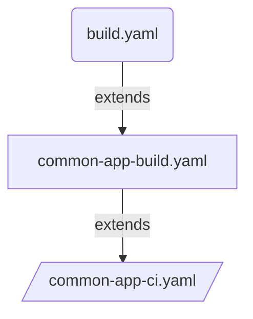

# Route to live deployment using CI & CD pipeline template

## Introduction

Extend the `common-app-ci.yaml` pipeline-template to create your route-to-live build and deployment strategy. This allows to set the list of environments that compose the route-to-live progression. 




## Overview of pipeline

```yaml
stage: Application_CI
  jobs: 
    job: Initialise
      steps: 
        task: GetAppVersion
    job: Build
    dependsOn: Initialise
      steps:         
        task: Sonar Analysis prepare
        # if .Net App
            task: UseDotNet Version
            task: DotNetCoreCLI Restore
            task: DotNetCoreCLI Build
            task: DotNetCoreCLI test
            task: Publish Code Coverage Results
        # if Node JS App
            task: NodeTool Version
            task: Npm ci
            task: Npm audit     # Fail pipeline for threashold breach, if PR build
            task: Npm lint      # if-present, Fail pipeline for threashold breach, if PR build
            task: Npm build     # if-present
            task: Npm unit test # if-present
            task: Publish Code Coverage Results
        task: Sonar Analysis Publish
        task: Snyk application security scan # Fail pipeline for threashold breach, if PR build        
    job: BuildDockerImage
    dependsOn: Initialise
        task: Docker Build Image
        task: Snyk container security scan # Fail pipeline for threashold breach, if PR build
    job: PreDeploymentTests
    dependsOn: BuildDockerImage
        task: install-additional-tools (docker-compose-update)
        task: Provision Resources for Tests
        task: integration-test
        task: service-acceptance-test
        task: owasp-test-zap
        task: accessibility-test-axe
        task: performance-test-jmeter
        task: acceptance-test
        task: Delete Dynamically provisioned resources

    job: BuildHelmChart
    dependsOn: Initialise
        task: Helm Lint        
        task: Helm Add KV Roleassignment template to ASO Infra helm chart        
        task: Helm LintAndBuild Chart
    job: Publish Artifacts
    dependsOn: Initialise,Build,BuildDockerImage,PreDeploymentTests,BuildHelmChart
        task: Publish Artifact - code version
        task: Publish Artifact - docker image
        task: Publish Artifact - helm chart
        #If main branch build only
        task: Tag             #Create or Force Update to latest commit
        task: Github Release  #Create if not exists
#For Each environment
#If master or main Branch build - Deploy to all environments
#If PR or Feature Branch build - Deploy to dev environment only
stage: Application_CD
dependsOn: Application_CI
  jobs: 
    deployment: PublishTo<Env>
      steps:
        task: Download artificats (code version, docker image, helm chart)
        task: List variables from variable group using az pipelines cli
        task: Push secrets from variable group to application keyvault
        task: Validate and Merge Azure App Configuration json or yaml file(s)
        task: Replace Tokens in Configuration json file
        task: Push changes in App Configuration file to AzureAppConfig
        task: Push Docker Image to ACR
        task: Push Helm Chart to ACR
      # Post Deployment Test if applicable for given env
        task: install-additional-tools (docker-compose-update)
        task: performance-test-jmeter
        task: acceptance-test
```

## Usage

Following pipeline `common-app-build.yaml` code snippet is an example of how to call `common-app-ci.yaml` template to implement CI and CD steps by abstacting the infrastructure details from dev team. So Dev team can focus on real development.

```yaml
# Example of abstracting the CI pipeline from dev team

parameters:
  - name: serviceName
    displayName: Project name
    type: string
  - name: deployFromFeature
    type: boolean
    default: false 
  - name: deployConfigOnly
    displayName: Deploy App Config Only
    type: boolean
    default: false       
  - name: appBuildConfig
    displayName: Details to build the app
    type: object
  - name: appTestConfig
    displayName: Details to test the app
    type: object
    default: null
  - name: appDeployConfig
    displayName: Details to deploy the app
    type: object
    default: null
  - name: sharedAcrConfig
    type: object
resources:
  repositories:
    - repository: PipelineCommon
      name: DEFRA/ADO-Pipeline-Common
      endpoint: DEFRA
      type: github
      ref: main

extends:
  template: /templates/pipelines/common-app-ci.yaml@PipelineCommon
  parameters:
    serviceName: ${{ parameters.serviceName }}              #Mandatory: Project Name
    deployFromFeature: ${{ parameters.deployFromFeature }}  #Mandatory: True/False(default)  parameter used to deploy feature branch to dev environment.
    deployConfigOnly: ${{ parameters.deployConfigOnly }}    #Mandatory: True/False(default)  parameter used to deploy app config to various environments.
    privateAgentName: 'DEFRA-ubuntu2204'                    #Optional:  Name of the private build agent. default will use Azure hosted linux agent.
    packageFeedName: 'artifact-feed'                        #Optional: Name of the Azure Devops Artifacts package feed. Used by .Net and NodeJs build.
    appBuildConfig: ${{ parameters.appBuildConfig }}        #Mandatory: Object which contains configration used for building the application. Such as appFrameworkType, defaultBranch, frameworkVersion, projectPath, manifestPath, imageRepoName
      githubreleaseconnection: 'github connection'          #Mandatory: Should be a OAuth or PAT. Used to tag and create github release
    appTestConfig: ${{ parameters.appTestConfig }}          #Mandatory: Object which contains configration used for testing the application. Such as testFilePath, 
      preDeployTest:                                        #Mandatory Pre deployment test variables
        envToTest: snd1                                     #Mandatory Pre deployment test environment name
        serviceConnection: AZD-ADP-SND1                     #Mandatory Service connection for Pre deployment test env
        azureServiceBusResourceGroup: rg                    #Mandatory Service Bus RG for Pre deployment test env
        azureServiceBusNamespace: name                      #Mandatory Service Bus namespace for Pre deployment test env
        testsToRun: 'integration;owasp;accessibility'       #Optional: sets the list of tests to run for feature branch.
      postDeployTest:                                       #Mandatory Post deployment test variables
        envToTest: snd3                                     #Mandatory Post deployment test environment name
        domain: 'adp.defra.gov.uk'                          #Mandatory Post deployment test domain name 
    appDeployConfig: ${{ parameters.appDeployConfig }}      #Mandatory: Object which contains configration used for application deployment. Such as config file path.
    sharedAcrConfig:                                        #Mandatory: Object which contains configration for helm lint and build
      name: 'ssvadpinfcr3401'
      serviceConnection: 'AZD-ADP-SSV3'
    snykConfig:                                             #Optional: 
      snykConnection: 'Connection name'                     #Mandatory: Name of the connection in ADO
      snykOrganizationName: 'defra'                         #Mandatory: Name of snyk organization
      failOnThreshold: 'critical'                           #Mandatory: Threshold to fail the task if vulrarabilies identified
    sonarConfig:                                            #Optional: 
      sonarConnection: 'SonarCloud Connection name'         #Mandatory: Name of the connection in ADO
      keyVaultServiceConnection: ''                         #Mandatory: service connection used to connect to Keyvault
      keyVaultName: ''                                      #Mandatory: Keyvault containing sonar api key
      keyVaultSecretName: 'SONAR-API-KEY'                   #Mandatory: secret name
      organization: defra                                   #Mandatory: Name of organization
      projectKeyPrefix: 'adp-'                              #Optional:  Prefix to be added while creating project key in Sonar
    npmConfig:                                              #Mandatory: 
      failOnThreshold: 'moderate'                           #Mandatory: Threshold to fail the task if issues identified
    environments:                                           #Mandatory: List of environments to deploy the application
      - name : sandbox                                      #Mandatory: name of the environment
        type : dev                                          #Mandatory: Type of the environment could be [dev,test,staging,prod]. feature branches will be deployed to dev env 
        serviceConnection: 'ARM Connection'                 #Mandatory: Name of the connection to be used for deployment
        acrName: 'acr name'                                 #Mandatory: Name of the ACR to push the docker and helm charts
        privateAgentName: 'sandbox-ubuntu2204'              #Optional:  Name of the private build agent, default will use Azure hosted linux agent.
        appConfiguration: 'application configration name'   #Mandatory:  Name of the Azure application configuration instance to push the config and secrets
        appKeyVault: 'application keyvault name'            #Mandatory:  Name of the Azure application keyvault instance to push the secrets from variable groups
        dependsOn: [ Application_CI ]                       #Mandatory: Names of one ore more stages. Application_CI stage is mandatory for all deployments


```

## Dev Team to extend the above pipeline template as follows

### build.yaml for .Net App

```yaml
parameters:
  - name: deployFromFeature
    displayName: "Deploy from Feature Branch"
    type: boolean
    default: false
  - name: deployConfigOnly
    displayName: "Deploy App Config & Secrets Only"
    type: boolean
    default: false  
pr:
  branches:
    include:
      - master
  paths:
    exclude:
      - test-output/*
      - bin/*
      - obj/*
  drafts: false

trigger:
  batch: true
  branches:
    include:
      - "*"
  paths:
    exclude:
      - test-output/*
      - bin/*
      - obj/*

resources:
  repositories:
    - repository: DEFRA-ADPPipelineCommon
      name: DEFRA/adp-pipeline-common
      endpoint: DEFRA
      type: github
      ref: main
extends:
    template: /pipelines/common-app-build.yaml@DEFRA-ADPPipelineCommon
    parameters:
        serviceName: "serviceName"          #Mandatory
        deployFromFeature: true            #Mandatory: Default false. If set to True will deploy the feature branch code to Dev environment.
        deployConfigOnly: ${{ parameters.deployConfigOnly }} #Mandatory: True/False(default)  parameter used to deploy app config to various environments.
        appBuildConfig:
            appFrameworkType: "dotnet"      # Mandatory "dotnet" or "nodejs" used to run the appropriate build step            
            frameworkVersion: "6.x"         #Optional: Used by DotNet build task. Defaults to 6.x
            projectPath: "./ProjectName/ProjectName.csproj" #Mandatory: Used to extract project version. For DotNet projects provide the csproj file path. For NodeJS package.json file path.
            testProjectPath: "./ProjectName.Tests/ProjectName.Tests.csproj" #Optional: Used to run Unit Tests of DotNet Projects
            manifestPath: "./obj/ProjectName/project.assets.json" #Mandatory: Used by Snyk to identify the vulnerabilities.  packages.config (.NET Framework) .proj file or project.json or project.assets.json for (.NET Core) package.json for (NodeJS)
            imageRepoName: "repo-name"      #Mandatory: Used for publishing docker, helm charts and also used by snyk to publish the results
        appTestConfig:                      #Optional : Used for testing application
          preDeployTest:                    #Optional: Used for testing application
            testsToRun:                     #Optional: Specify the list of pre deployment tests to run. integration, service-acceptance,owasp, accessibility,performance,acceptance. If not specified default tests for feature brach: integration;owasp;accessibility. PR branch will run all available tests.
              - owasp                       
              - accessibility
          postDeployTest:                   #Optional Post deployment test variables
            envToTest: snd3                 #Optional Post deployment test environment name. Default snd3
            domain: 'adp.defra.gov.uk'      #Optional Post deployment test domain name. Default adp.defra.gov.uk
        appDeployConfig:                    #Optional: Used for deploying application configuration to various environments
            filepath: "./appConfig"         #Optional: Folder path of app configuration files
            filetype: "yaml"                #Optional: default value json
            variableGroups:                 #Optional: List of variable groups which contain secrets
              - variableGroup<environment>  #Optional: Variable Group name, if specified with <environment>, relevant env specific variables will be imported
            variables:                      #Optional: List of variables used by the service, if not specified all variables will be imported
              - servicename-variable1       #Optional: If specific variable is defined, only those variables will be imported
              - servicename-*               #Optional: Filter will be applied by matching the variable name
            programmeName: "programmeName"  #Optional: Programme name - used in variable group
```

### build.yaml for NodeJS App

```yaml
parameters:
  - name: deployFromFeature
    displayName: "Deploy from Feature Branch"
    type: boolean
    default: false
  - name: deployConfigOnly
    displayName: "Deploy App Config & Secrets Only"
    type: boolean
    default: false  
pr:
  branches:
    include:
      - main
  paths:
    exclude:
      - test-output/*
      - bin/*
      - obj/*
  drafts: false

trigger:
  batch: true
  branches:
    include:
      - "*"
  paths:
    exclude:
      - test-output/*
      - bin/*
      - obj/*
resources:
  repositories:
    - repository: DEFRA-ADPPipelineCommon
      name: DEFRA/adp-pipeline-common
      endpoint: DEFRA
      type: github
      ref: main
extends:
    template: /pipelines/common-app-build.yaml@DEFRA-ADPPipelineCommon
    parameters:
        serviceName: "serviceName"          #Mandatory
        deployFromFeature: ${{ parameters.deployFromFeature }}  #Mandatory: Default false. If set to True will deploy the feature branch code to Dev environment.
        deployConfigOnly: ${{ parameters.deployConfigOnly }} #Mandatory: True/False(default)  parameter used to deploy app config to various environments.
        appBuildConfig:
            appFrameworkType: "nodejs"      #Mandatory: "dotnet" or "nodejs" used to run the appropriate build step            
            frameworkVersion: "18.x"        #Optional: Used by DotNet and Nodejs build task. Defaults to 6.x. For Node JS 18.x
            projectPath: "./package.json"   #Mandatory: Used to extract project version. For DotNet projects provide the csproj file path. For NodeJS package.json file path.
            manifestPath: "./package.json"  #Mandatory: Used by Snyk to identify the vulnerabilities.  packages.config (.NET Framework) .proj file or project.json or project.assets.json for (.NET Core) package.json for (NodeJS)
            imageRepoName: "repo-name"      #Mandatory: Used for publishing docker, helm charts and also used by snyk to publish the results
        appTestConfig:                      #Optional : Used for testing application
          preDeployTest:                    #Optional: Used for testing application
            testsToRun:                     #Optional: Specify the list of pre deployment tests to run. integration, service-acceptance,owasp, accessibility,performance,acceptance. If not specified default tests for feature brach: integration;owasp;accessibility. PR branch will run all available tests.
              - owasp                       
              - accessibility
          postDeployTest:                   #Optional Post deployment test variables
            envToTest: snd3                 #Optional Post deployment test environment name. Default snd3
            domain: 'adp.defra.gov.uk'      #Optional Post deployment test domain name. Default adp.defra.gov.uk
        appDeployConfig:                    #Optional: Used for deploying application configuration to various environments
            filepath: "./appConfig"         #Optional: Folder path of app configuration files
            filetype: "yaml"                #Optional: default value json
            variableGroups:                 #Optional: List of variable groups which contain secrets
              - variableGroup<environment>  #Optional: Variable Group name, if specified with <environment>, relevant env specific variables will be imported
            variables:                      #Optional: List of variables used by the service, if not specified all variables will be imported
              - servicename-variable1       #Optional: If specific variable is defined, only those variables will be imported
              - servicename-*               #Optional: Filter will be applied by matching the variable name
            programmeName: "programmeName"  #Optional: Programme name - used in variable group
```
