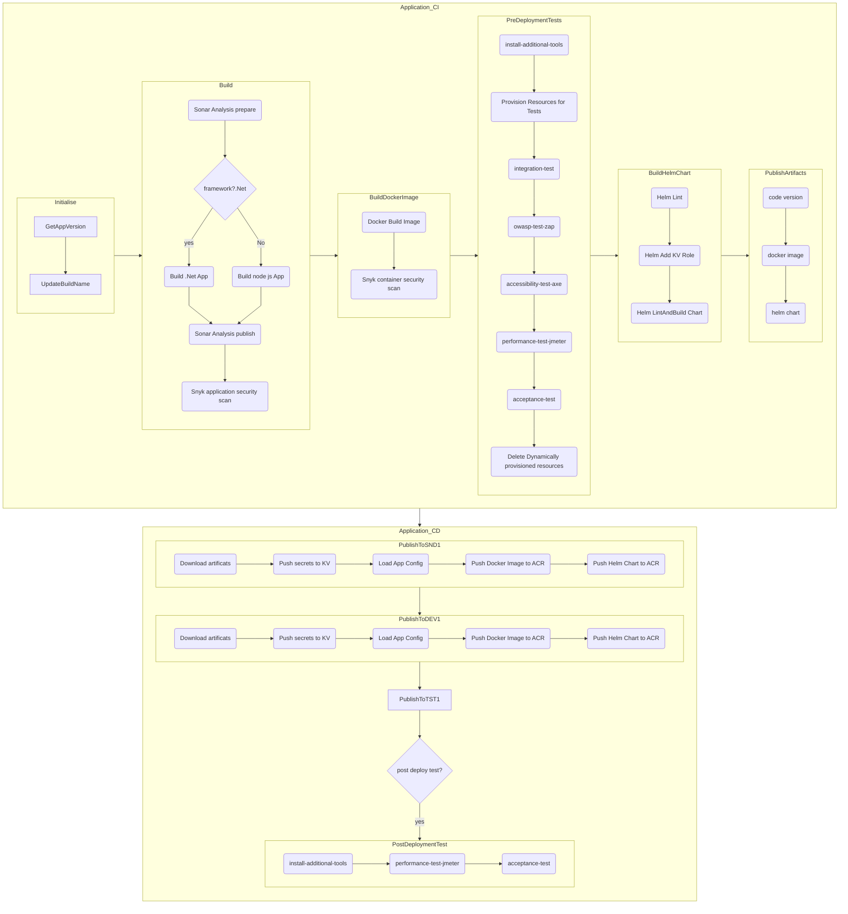

```mermaid
%%{init: { "flowchart": { "htmlLabels": true, "curve": "linear" } } }%%
flowchart TD
Application_CI --> Application_CD
subgraph Application_CI
Initialise --> Build --> BuildDockerImage --> PreDeploymentTests --> BuildHelmChart --> PublishArtifacts
    subgraph Initialise
        GetAppVersion --> UpdateBuildName        
    end
    subgraph Build
    direction TB
        A21(Sonar Analysis prepare) --> A22{framework?.Net}
        A22 --> |yes| A23(Build .Net App)
        A22 --> |No| A24(Build node js App)
        A23 -->  A25(Sonar Analysis publish)
        A24 -->  A25 --> A26(Snyk application security scan)
    end
    subgraph BuildDockerImage
        C11(Docker Build Image) --> C12(Snyk container security scan)        
    end
    subgraph PreDeploymentTests
    direction TB
        D11(install-additional-tools) --> D12(Provision Resources for Tests)   
        D12 --> D13(integration-test) --> D14(owasp-test-zap)       
        D14 --> D15(accessibility-test-axe)  --> D16(performance-test-jmeter)     
        D16 --> D17(acceptance-test)  --> D18(Delete Dynamically provisioned resources)     
    end
    subgraph BuildHelmChart
        E11(Helm Lint  ) --> E12(Helm Add KV Role) --> E13(Helm LintAndBuild Chart)       
    end
    subgraph PublishArtifacts
        F11(code version  ) --> F12(docker image) --> F13(helm chart)       
    end
end
subgraph Application_CD
    direction TB
    PublishToSND1 --> PublishToDEV1 --> PublishToTST1 --> X1{post deploy test?}
    X1 --> |yes| PostDeploymentTest
    subgraph PublishToSND1
        G11(Download artificats) --> G12(Push secrets to KV) --> G13(Load App Config)  
        G13 --> G14(Push Docker Image to ACR) --> G15(Push Helm Chart to ACR)       
    end
    subgraph PublishToDEV1
        H11(Download artificats) --> H12(Push secrets to KV) --> H13(Load App Config)  
        H13 --> H14(Push Docker Image to ACR) --> H15(Push Helm Chart to ACR)       
    end
    subgraph PostDeploymentTest
        I11(install-additional-tools) --> I12(performance-test-jmeter)  
        I12 --> I13(acceptance-test)  
    end
end

```