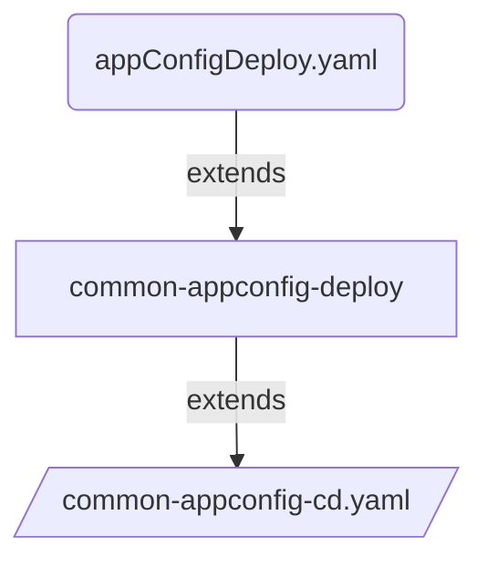

# Route to live deployment using CI & CD pipeline template

## Introduction

Extend the `common-app-ci.yaml` pipeline-template to create your route-to-live build and deployment strategy. This allows to set the list of environments that compose the route-to-live progression. 




## Overview of pipeline

```yaml
#For Each environment
stage: deploymentEnvName
  jobs: 
    job: ImportSecret
      steps: 
        task: import each secrets
    job: DryRun
      steps: 
        task: App Config Import Dry Run       
    job: Review    
    job: Publish
        task: App Config Import

```

## Usage

Following pipeline `common-app-build.yaml` code snippet is an example of how to call `common-appconfig-cd.yaml` template to implement CI and CD steps by abstacting the infrastructure details from dev team. So Dev team can focus on real development.

```yaml
# Example of abstracting the CI pipeline from dev team

parameters:
  - name: serviceName
    displayName: Project name
    type: string
  - name: appDeployConfig
    displayName: Details to deploy the app
    type: object
    default: null

resources:
  repositories:
    - repository: PipelineCommon
      name: DEFRA/ADO-Pipeline-Common
      endpoint: DEFRA
      type: github
      ref: main

extends:
  template: /templates/pipelines/common-appconfig-cd.yaml@PipelineCommon
  parameters:
    serviceName: ${{ parameters.serviceName }}              #Mandatory: Project Name        
    appDeployConfig: ${{ parameters.appDeployConfig }}      #Mandatory: Object which contains configration used for application deployment. Such as config file path.    
    environments:                                           #Mandatory: List of environments to deploy the application
      - name : sandbox                                      #Mandatory: name of the environment
        type : dev                                          #Mandatory: Type of the environment could be [dev,test,staging,prod]. feature branches will be deployed to dev env 
        serviceConnection: 'ARM Connection'                 #Mandatory: Name of the connection to be used for deployment
        subscriptionId: 'subscription id'                   #Mandatory: Subscription id used by app config import task
        acrName: 'acr name'                                 #Mandatory: Name of the ACR to push the docker and helm charts
        privateAgentName: 'sandbox-ubuntu2204'              #Optional:  Name of the private build agent, default will use Azure hosted linux agent.
        appConfiguration: 'application configration name'   #Mandatory:  Name of the Azure application configuration instance to push the config and secrets
        appKeyVault: 'application keyvault name'            #Mandatory:  Name of the Azure application keyvault instance to push the secrets from variable groups
        


```

## Dev Team to extend the above pipeline template as follows

### appConfigDeploy.yaml 

```yaml
pr:
  branches:
    include:
      - main
  paths:
    include:
      - config/*
  drafts: false

trigger:
  batch: true
  branches:
    include:
      - "*"
  paths:
    exclude:
      - test-output/*
      - bin/*
      - obj/*

resources:
  repositories:
    - repository: DEFRA-ADPPipelineCommon
      name: DEFRA/adp-pipeline-common
      endpoint: DEFRA
      type: github
      ref: main
extends:
    template: /pipelines/common-appconfig-deploy.yaml@DEFRA-ADPPipelineCommon
    parameters:
        serviceName: "serviceName"          #Mandatory        
        appDeployConfig:                    #Optional: Used for deploying application configuration to various environments
            filepath: "./appConfig"         #Optional: Folder path of app configuration files
            variableGroups:                 #Optional: List of variable groups which contain secrets
              - variableGroup1              #Optional: Variable Group name 
              - variableGroup2      
            variables:                      #Optional: List of variables used by the service
              - variable1
              - variable2

```
