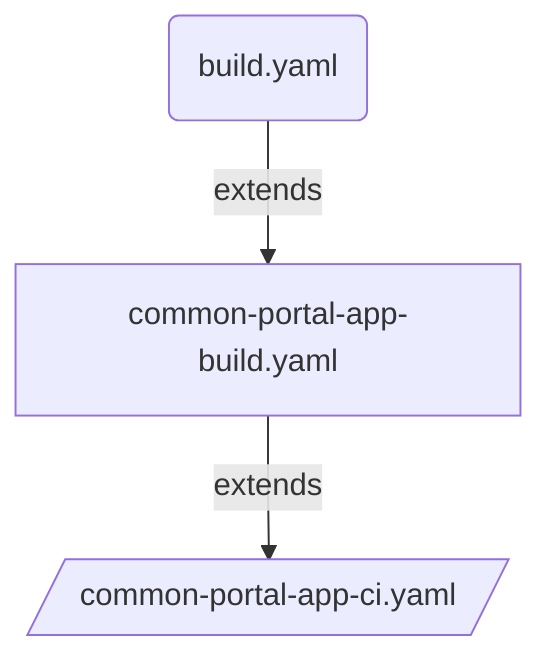

# Route to live deployment using CI & CD pipeline template for Backstage Portal

## Introduction

Extend the `common-portal-app-ci.yaml` pipeline-template to create your route-to-live build and deployment strategy. This allows to set the list of environments that compose the route-to-live progression.




## Overview of pipeline

```yaml
stage: Application_CI
  jobs: 
    job: Initialise
      steps: 
        task: GetAppVersion
    job: Build
    dependsOn: Initialise
      steps: 
        task: Yarn Build
        task: Docker Build Image
        task: Snyk container security scan # Fail pipeline for threashold breach, if PR build
    job: Publish Artifacts
    dependsOn: Initialise,Build,BuildImage
        task: Publish Artifact - code version
        task: Publish Artifact - docker image
#For Each environment
#If master or main Branch build - Deploy to all environments
#If PR or Feature Branch build - Deploy to dev environment only
stage: Application_CD
dependsOn: Application_CI
  jobs: 
    deployment: PublishTo<Env>
      steps:
        task: Download artificats (code version, docker image, helm chart)
        task: Push secrets from variable group to application keyvault        
        task: Push Docker Image to ACR
        task: Replace Tokens in Configuration json file
        task: Deploy Container App

```

## Usage

Following pipeline `common-portal-app-build.yaml` code snippet is an example of how to call `common-portal-app-ci.yaml` template to implement CI and CD steps by abstacting the infrastructure details from dev team. So Dev team can focus on real development.

```yaml
# Example of abstracting the CI pipeline from dev team

parameters:
  - name: serviceName
    displayName: service name
    type: string
    default: null
  - name: deployFromFeature
    type: boolean
    default: false     
  - name: appBuildConfig
    displayName: Details to build the app
    type: object
  - name: appDeployConfig
    displayName: Details to deploy the app
    type: object
    default: null
resources:
  repositories:
    - repository: PipelineCommon
      name: DEFRA/ADO-Pipeline-Common
      endpoint: DEFRA
      type: github
      ref: main

extends:
  template: /templates/pipelines/common-portal-app-ci.yaml@PipelineCommon
  parameters:
    serviceName: ${{ parameters.serviceName }}              #Mandatory: Project Name
    deployFromFeature: ${{ parameters.deployFromFeature }}  #Mandatory: True/False(default)  parameter used to deploy feature branch to dev environment.
    deployConfigOnly: ${{ parameters.deployConfigOnly }}    #Mandatory: True/False(default)  parameter used to deploy app config to various environments.
    privateAgentName: 'DEFRA-ubuntu2204'                    #Optional:  Name of the private build agent. default will use Azure hosted linux agent.
    appBuildConfig: ${{ parameters.appBuildConfig }}        #Mandatory: Object which contains configration used for building the application. Such as appFrameworkType, defaultBranch, frameworkVersion, projectPath, manifestPath, imageRepoName
    appDeployConfig: ${{ parameters.appDeployConfig }}      #Mandatory: Object which contains configration used for application deployment. Such as config file path.
    snykConfig:                                             #Optional: 
      snykConnection: 'Connection name'                     #Mandatory: Name of the connection in ADO
      snykOrganizationName: 'defra'                         #Mandatory: Name of snyk organization
      failOnThreshold: 'critical'                           #Mandatory: Threshold to fail the task if vulrarabilies identified
    environments:                                           #Mandatory: List of environments to deploy the application
      - name : sandbox                                      #Mandatory: name of the environment
        type : dev                                          #Mandatory: Type of the environment could be [dev,test,staging,prod]. feature branches will be deployed to dev env 
        serviceConnection: 'ARM Connection'                 #Mandatory: Name of the connection to be used for deployment
        acrName: 'acr name'                                 #Mandatory: Name of the ACR to push the docker and helm charts
        privateAgentName: 'sandbox-ubuntu2204'              #Optional:  Name of the private build agent, default will use Azure hosted linux agent.
        subscriptionId: 'Subscription id'                   #Mandatory:  Subscription ID
        resourceGroup: 'Resource group name'                #Mandatory: Resource group to which the application to be deployed
        appKeyVault: 'application keyvault name'            #Mandatory:  Name of the Azure application keyvault instance to push the secrets from variable groups
        userAssignedIdentity: 'userAssignedIdentity Name' #Mandatory: userAssignedIdentity Name
        managedEnvironmentId : 'EnvironmentId Name' #Mandatory: EnvironmentId Name
        containerAppName: 'name of the container app'       #Mandatory: Name of the container app
        dependsOn: [ Application_CI ]                       #Mandatory: Names of one ore more stages. Application_CI stage is mandatory for all deployments


```

## Dev Team to extend the above pipeline template as follows

### build.yaml for .Net App

```yaml
parameters:
  - name: deployFromFeature
    displayName: "Deploy from Feature Branch"
    type: boolean
    default: false
pr:
  branches:
    include:
      - main
  paths:
    exclude:
      - test-output/*
      - bin/*
      - obj/*
  drafts: false

trigger:
  batch: true
  branches:
    include:
      - "main"
  paths:
    exclude:
      - test-output/*
      - bin/*
      - obj/*

resources:
  repositories:
    - repository: DEFRA-ADPPipelineCommon
      name: DEFRA/adp-pipeline-common
      endpoint: DEFRA
      type: github
      ref: main
extends:
    template: /pipelines/common-portal-app-build.yaml@DEFRA-ADPPipelineCommon
    parameters:
        serviceName: "serviceName"          #Mandatory
        deployFromFeature: true            #Mandatory: Default false. If set to True will deploy the feature branch code to Dev environment.        
        appBuildConfig:
            appFrameworkType: "nodejs"      # Mandatory "dotnet" or "nodejs" used to run the appropriate build step                              
            projectPath: "./package.json"   #Mandatory: Used to extract project version. For DotNet projects provide the csproj file path. For NodeJS package.json file path.
            appPath: "/app"  #Mandatory: App folder within the repo
            dockerfilePath: "./packages/backend/Dockerfile" #Mandatory: Docker file path
            imageRepoName: "repo-name"      #Mandatory: Used for publishing docker
        appDeployConfig:                    #Optional: Used for deploying application configuration to various environments
            filepath: ".azuredevops/backstage.yaml"         #Mandatory: Application Yaml file path
            variableGroups:                 #Optional: List of variable groups which contain secrets
              - variableGroup1              #Optional: Variable Group name 
              - variableGroup2      
            variables:                      #Optional: used by the service
              - variable1
              - variable2
```
