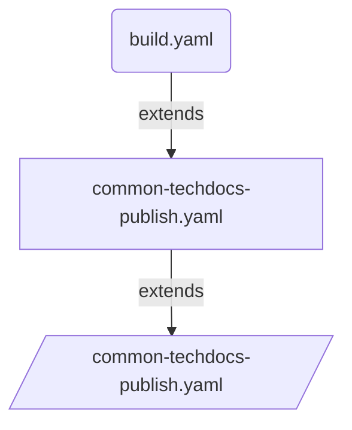

# Route to live deployment using CI & CD pipeline template for Backstage Portal Techdocs

## Introduction

Extend the `common-techdocs-publish` pipeline-template to create your route-to-live build and publish strategy. This allows to set the list of environments that compose the route-to-live progression.




## Overview of pipeline

```yaml
stage: Build
  jobs: 
    job: Generate
      steps: 
        task: Generate Docs
        task: Publish Artifact 
#For Each environment
stage: Publish
dependsOn: Build
  jobs: 
    deployment: PublishTo<Env>
      steps:
        task: Download Artifact (site)
        task: Push site html to storage account      

```

## Usage

Following pipeline `common-portal-app-build.yaml` code snippet is an example of how to call `common-portal-app-ci.yaml` template to implement CI and CD steps by abstacting the infrastructure details from dev team. So Dev team can focus on real development.

```yaml
# Example of abstracting the CI pipeline from dev team

parameters:
  - name: EntityName
    type: string
  - name: WikiRepoName
    type: string
  - name: DocsPath
    type: string
    default: ''  

resources:
  repositories:
    - repository: PipelineCommon
      name: DEFRA/ADO-Pipeline-Common
      endpoint: DEFRA
      type: github
      ref: refs/heads/main

extends:
  template: /templates/pipelines/common-techdocs-publish.yaml@PipelineCommon
  parameters:
    config:
      EntityName: ${{ parameters.EntityName }}            #Mandatory: Name of the backstage component in the format default/component/name
      WikiRepoName: ${{ parameters.WikiRepoName }}        #Mandatory: Name of the wiki repo referenced in the template, if self leave blank
      DocsPath: ${{ coalesce(parameters.DocsPath, '') }}  #Mandatory: relative path of the mkdocs file within the repo
    privateAgentName: 'DEFRA-COMMON-ubuntu2204-SSV3'     
    environments:                                           #Mandatory: List of environments to deploy the application
      - name : ssv3                                      #Mandatory: name of the environment
        type : dev                                          #Mandatory: Type of the environment could be [dev,test,staging,prod]. feature branches will be deployed to dev env 
        serviceConnection: 'ARM Connection'                 #Mandatory: Name of the connection to be used for deployment        
        privateAgentName: 'sandbox-ubuntu2204'              #Mandatory:  Name of the private build agent, default will use Azure hosted linux agent.        
        resourceGroup: 'Resource group name'                #Mandatory: Resource group to which the application to be deployed
        StorageAccountName: 'storage account name'          #Mandatory:  storage account to store the generated docs 
        ContainerName: 'blob container Name'                #Mandatory: Blob container Name        
        dependsOn: [ Build ]                       #Mandatory: Names of one ore more stages. Build stage is mandatory for all deployments


```

## Dev Team to extend the above pipeline template as follows

### build.yaml for .Net App

```yaml
pr:
  branches:
    include:
      - main
  paths:
    exclude:
      - test-output/*
      - bin/*
      - obj/*
  drafts: false

resources:
  repositories:
    - repository: DEFRA-ADPPipelineCommon
      name: DEFRA/adp-pipeline-common
      endpoint: DEFRA
      type: github
      ref: refs/heads/main

    - repository: techdocs-wiki
      name: defra-adp-sandpit/techdocs-wiki
      endpoint: defra-adp-sandpit
      type: github
      ref: refs/heads/main
      trigger:
        batch: true
        branches:
          include:
            - "*"

extends:
  template: /pipelines/common-techdocs-publish.yaml@DEFRA-ADPPipelineCommon
  parameters:
    WikiRepoName: "techdocs-wiki"
    EntityName: 'default/component/adp-portal'
    DocsPath: '' #docs in root folder
```
