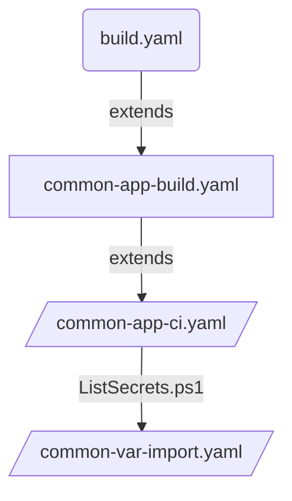

# Pipeline to import variable group secrets to Keyvault

## Introduction

Secret variables stored in Variable groups cannot be read directly by any script or devops API.
Secrests can only be mapped as env variables to a task as detailed in the following [link](https://www.winopsdba.com/blog/azure-devops-expose-secret-variable.html).
Since the pipeline env variables are evaluated at the time of trigger (compile time), we need to seperate the deployment pipeline and the variable import pipeline.

ListSecrets.ps1 : lists all variables applicable for the service from supplied list of variable groups and for the given environment.
ListSecrest powershell will run the pipeline named Defra.Import-Variables `common-var-import.yaml` using $(System.AccessToken) for AZURE_DEVOPS_EXT_PAT




## Permissions needed for System Account to execute and import variables

### 1. Pipeline

Project Collection Build Service (defragovuk) needs "Queue builds" permissions for build pipeline Defra.Import-Variables in team project DEFRA-FFC.

### 2. Variable Groups

#### 2.1 Security

Project Collection Build Service (defragovuk) - Reader

#### 2.2 Pipeline Permission

Variable groups should have access to the Defra.import-variables pipeline

### Run Pipeline

```powershell
# Example of abstracting the CI pipeline from dev team
$DevOpsProject = "FFC"
$ImportPipelineName = "Defra.Import-Variables"
$ImportPipelineBranch = "main"
$variablesArrayString = "variable1;variable2"
$VariableGroup = "variable group1"
$serviceConnection = "name of the service connection"
$AppKeyVault = "Application keyvault to import the secrets to"
$PrivateAgentName= "private agent pool name"
$BuildNumber = "Current Build Number"

$command = "az pipelines run --project $DevOpsProject --name $ImportPipelineName --branch $ImportPipelineBranch"
$prameters = " --parameters 'secretNames=$variablesArrayString' 'variableGroups=$VariableGroup' 'serviceConnection=$ServiceConnection' 'appKeyVault=$AppKeyVault' 'privateAgentName=$PrivateAgentName' "
$prameters = $prameters + " 'buildNumber=$BuildNumber' 'project=$DevOpsProject' 'organization=$DevOpOrganization'"
$buildQueue = Invoke-CommandLine -Command " $command $prameters  | ConvertFrom-Json" 
Write-Debug "buildQueue :$buildQueue"
Write-Host $buildQueue.url
GetPipelineBuildStatus -buildQueueId $buildQueue.id -organization $DevOpOrganization -project $DevOpsProject


```